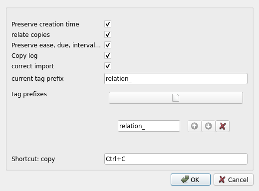

# Form to fill add-on configurations
## Rationale
Currently, anki's add-on are configured using a simple json text. This is not practical for people not used to deal with programming and text format.

I thus wanted to create forms for my add-ons. And was too lazy to create a form for my 60 add-ons and for the add-ons I use. So instead I created a form generator.

This form generator still need a little bit of work for each add-ons. It needs the add-on creator to gives a [json schema](https://json-schema.org/). I believe however that adding a schema is easier than creating a form. At least because add-ing a schema will be useful even if you don't care about the current add-on since anki 2.1.22 will use them to validate user's configuration before saving them.

* 
* 

## Warning
This add-on can currently only deal with simple schemas. That is, lists, objects (dictionnaries) in which all parameters are known, file path, directory path, string, integers, floating point number...

This should change as the add-on evolve. There is no reason to worry however, because if the add-on does not work, you can still use normal configuration editor.

## Technicals

### For add-on developpers
Add-on schema only let you tell that the expected type of a value, e.g. a string. In order to let Anki know which kind of user interface should be displayed to let the user enter the value, you nay add a parameter "ui:widget". E.g. `"ui:widget":"colour"` indicates that the string should be selected using QT's color selector. Please see [documentation](https://github.com/Arthur-Milchior/qt-jsonschema-form/blob/ui_in_schema/USAGE.md) to see all options.

### For contributor to this add-on
This add-on uses [qt-jsonschema-form](https://github.com/Arthur-Milchior/qt-jsonschema-form/tree/ui_in_schema) as a submodule. Once you have downloaded the current add-on, you should do `git submodule init` to download the submodule and ensure that you are on the branch `ui_in_schema`.

## TODO
Dealing with extra parameters. Dealing with values which may have multiple types (or even none type)

## Links, licence and credits

Key         |Value
------------|-------------------------------------------------------------------
Copyright   | Arthur Milchior <arthur@milchior.fr>
Based on    | Anki code by Damien Elmes <anki@ichi2.net>
License     | GNU AGPL, version 3 or later; http://www.gnu.org/licenses/agpl.html
Source in   | https://github.com/Arthur-Milchior/anki-gui-for-addon-config
Addon number| [1014777615](https://ankiweb.net/shared/info/1014777615)
Support me on|  or 
